<p align="center">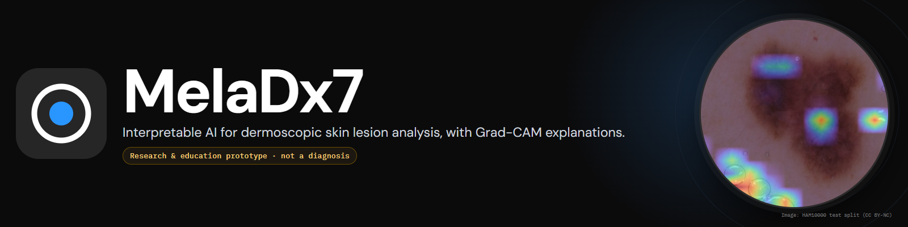</p>

# MelaDx7

**Interpretable Deep Learning for Skin Cancer Detection and Subtype Classification**

MelaDx7 analyses dermoscopic skin-lesion images with a Vision Transformer (ViT-Base/16),
reports a calibrated probability for every lesion class, and explains each prediction
with a Grad-CAM heatmap of the image regions that drove it. It is a complete system:
training pipeline, versioned model artifacts, a FastAPI inference service with
PostgreSQL, and a React web application.

> **Medical disclaimer.** This AI system provides an assistive prediction and
> visualization. It is not a medical diagnosis and should not replace evaluation by a
> qualified healthcare professional. MelaDx7 is a research and education prototype,
> not a medical device. It gives no treatment recommendations.

---

## Watch (50 s)

[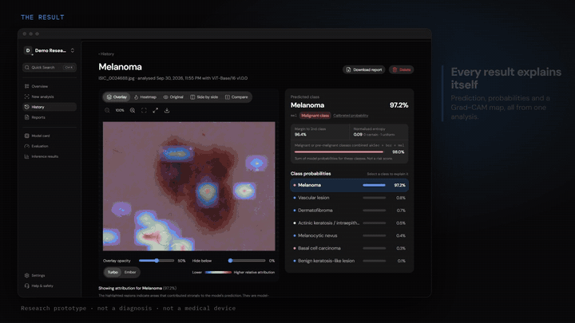](docs/media/meladx7-promo.mp4)

*Silent, with captions. The preview above is a short excerpt; click it for the full 1080p MP4
(`docs/media/meladx7-promo.mp4`). Everything on screen is the real application with the trained
model, and the numbers are read from its `metrics.json`. How the media was made:
[tools/promo](tools/promo/README.md).*

## Contents

[Problem](#problem-statement) · [Features](#features) · [Screenshots](#screenshots) ·
[Architecture](#architecture) · [Stack](#technology-stack) · [Structure](#project-structure) ·
[Quick start](#quick-start) · [Dataset](#dataset-setup) · [Training](#model-training) ·
[Evaluation](#model-evaluation) · [Inference](#model-setup-and-inference) ·
[API](#api) · [Grad-CAM](#grad-cam-in-one-paragraph) · [Testing](#testing) ·
[Security](#security) · [Limitations](#limitations) · [Ethics](#ethical-considerations) ·
[Roadmap](#future-improvements)

## Problem statement

Skin cancer is among the most common cancers, and early detection improves outcomes.
Visual examination of lesions is time-consuming and depends on the examiner's expertise.
Deep learning can classify dermoscopic images, but a label on its own is hard to trust:
a reviewer cannot tell whether the model looked at the lesion or at a ruler, hair or an
ink marking.

This project pairs a deep-learning classifier with explainable AI. For every image it returns the
predicted class, a calibrated probability for each class, an uncertainty assessment, and
a Grad-CAM map for any class, and it records exactly which model produced the result, so
a clinician or researcher can inspect, question and reproduce it.

## Features

**Analysis**
- Drag-and-drop upload with client and server validation (type by content, size,
  integrity, dimensions, decompression bombs); EXIF/GPS metadata is stripped.
- Probability for every class, predicted class and calibrated confidence (temperature
  scaling), uncertainty flags (low top probability, small margin, entropy).
- Combined probability of malignant/pre-malignant classes, labelled as a model-output
  sum, never a risk score.
- Heuristic image-quality warnings (resolution, exposure, contrast, focus).

**Explainable AI**
- Grad-CAM implemented from scratch with correctness tests.
- Viewer with overlay, heatmap, original, side-by-side and draggable comparison views;
  opacity, attribution threshold, two colour maps, zoom/pan (mouse, touch, keyboard),
  PNG download.
- Explanation for **any class** on demand, not just the predicted one.

**Records and reporting**
- History with search, class/probability/uncertainty/date filters, sorting, pagination.
- Report page with model version, weights SHA-256, preprocessing, calibration, timings
  and image hash; PDF report export.
- Re-run an analysis with a newer model; every model version's prediction is kept.
- Delete a single analysis, or the whole account with all images, maps and records.

**Model lifecycle (MLOps-ready)**
- Config-driven training: lesion-grouped stratified split, augmentation, class-imbalance
  handling, staged fine-tuning, warm-up + cosine LR, early stopping, checkpoint/resume,
  temperature calibration, held-out evaluation with per-class metrics, confusion matrix,
  ROC curves, calibration and a sample gallery.
- Versioned artifacts with a JSON model card; weights verified by SHA-256 and loaded with
  `weights_only=True`. Architecture and classes come from the card, so models swap
  without code changes.
- Model page separating **held-out evaluation**, **training metrics** and **real
  inference statistics**.

**Platform**
- JWT access tokens + rotating httpOnly refresh cookies with reuse detection; Argon2id.
- Local or S3-compatible storage behind one interface; signed, expiring image URLs.
- Structured JSON logs with request IDs; health checks; rate limits; security headers; CSP.
- Interface built to the product's Figma reference: a desktop dashboard with sidebar and
  quick search, and a separate native-feeling phone design (floating glass tab bar with an
  analyse button, bottom sheets, long-press menus, swipe-to-delete, pull-to-refresh, pinch
  zoom and swipe comparison, safe areas). Keyboard accessible; dark by default, light opt-in.
- Docker Compose deployment, CI workflow, automated tests for ML, API, UI and the browser end-to-end flow (counts in [Testing](#testing)).

**Honest by construction:** no bundled dataset, no hard-coded predictions, metrics or
heatmaps. Metrics are shown only if they were computed for the exact loaded weights
(SHA-256 match), and every result states that it is not a diagnosis.

## Screenshots

Taken from the running application with the trained ViT-Base/16 model, on real images
from the held-out test split (HAM10000, CC BY-NC). Every screen exists in dark (default) and
light; the theme is chosen in Settings (Dark / Light / System).

| Result with Grad-CAM (dark) | 
|---|
| 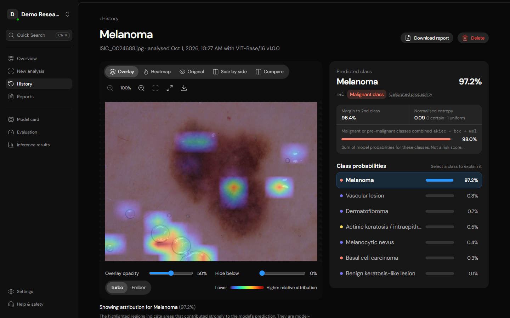 | 

| Overview | History |
|---|---|
| 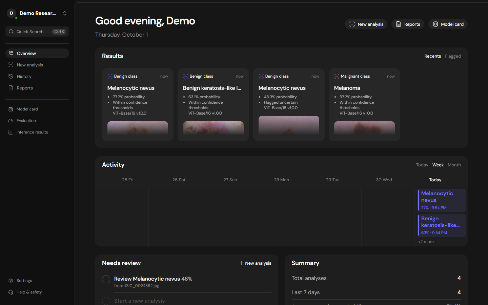 | 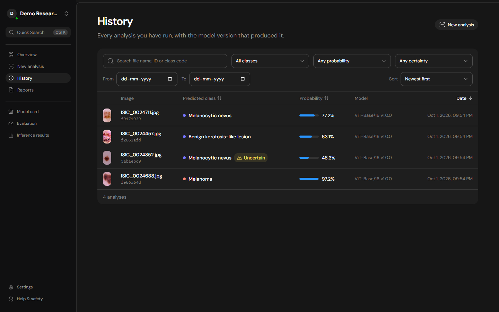 |

| Model card and evaluation | Settings: Dark / Light / System |
|---|---|
| 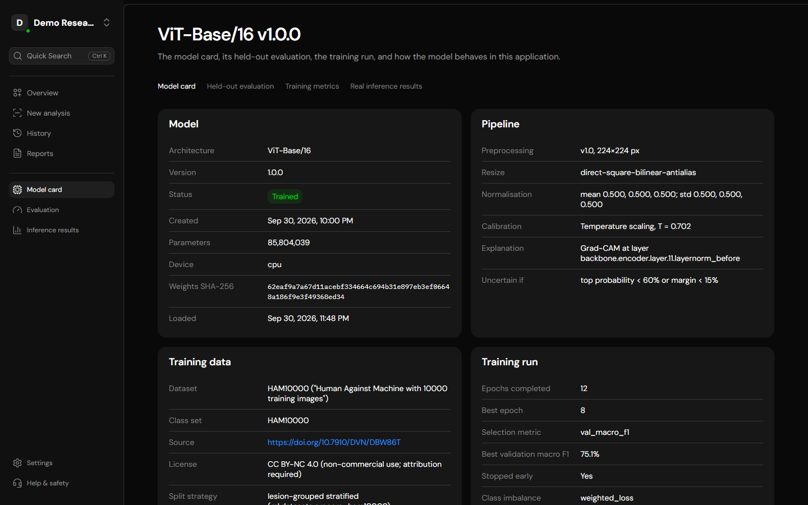 | 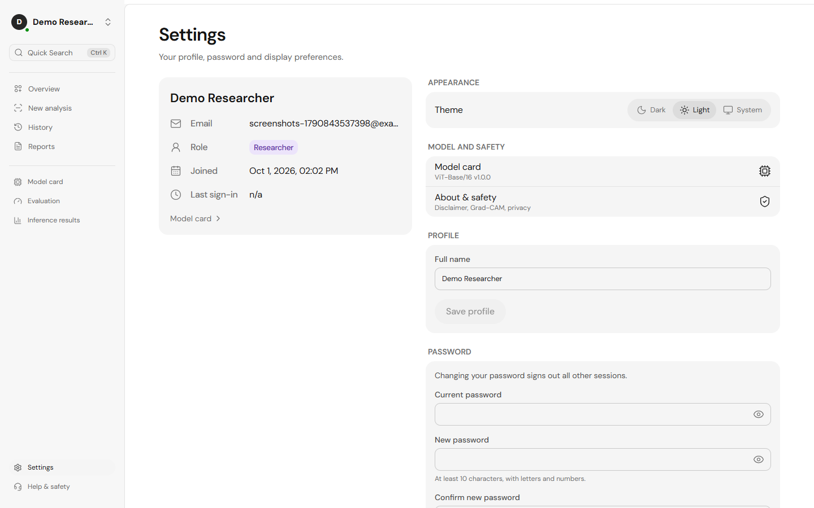 |

| New analysis | Reports |
|---|---|
| 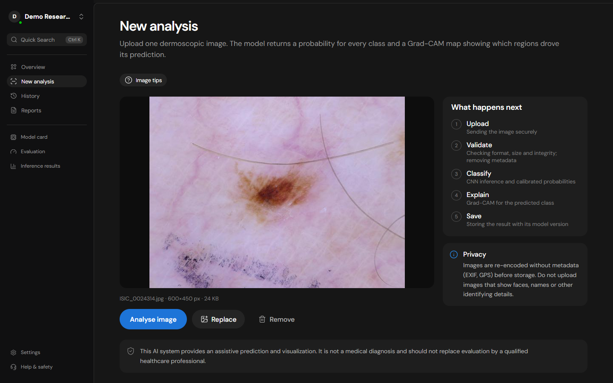 | 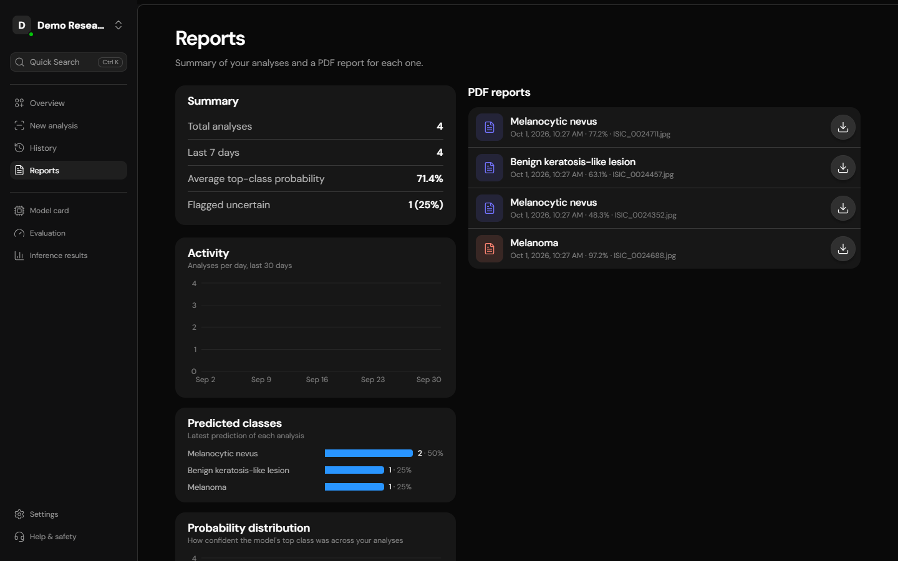 |

**Phone:** result with swipe comparison, overview, history and settings.

| Result | Overview | History | Settings |
|---|---|---|---|
| 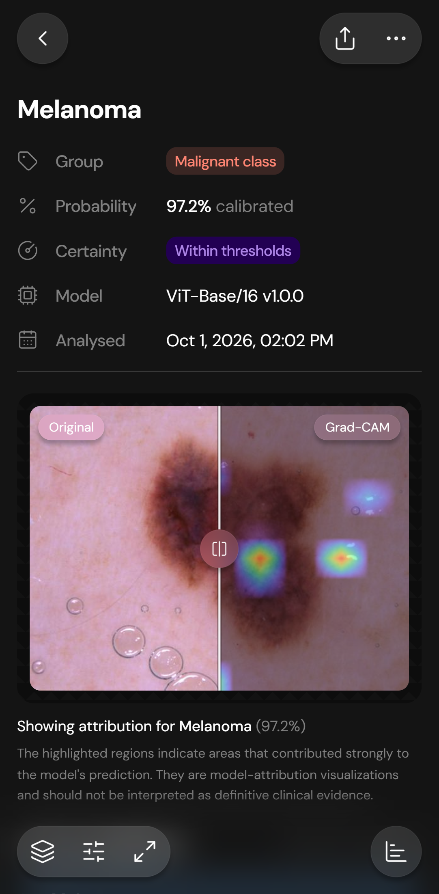 | 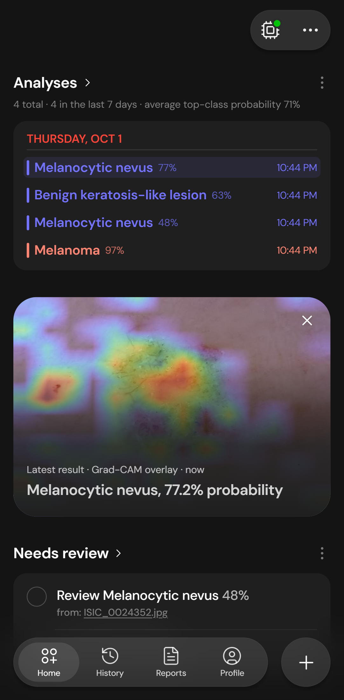 | 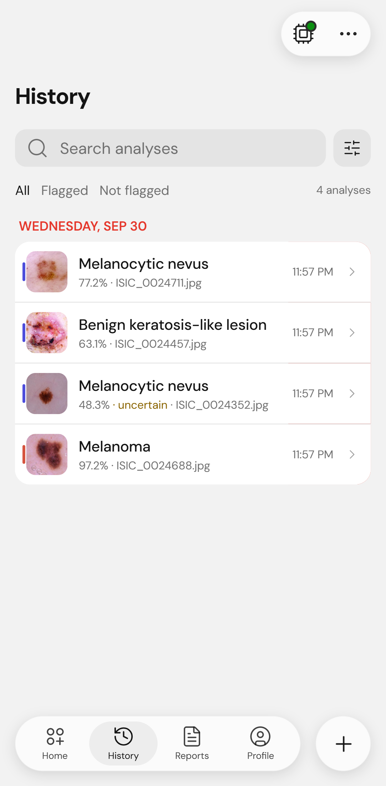 | 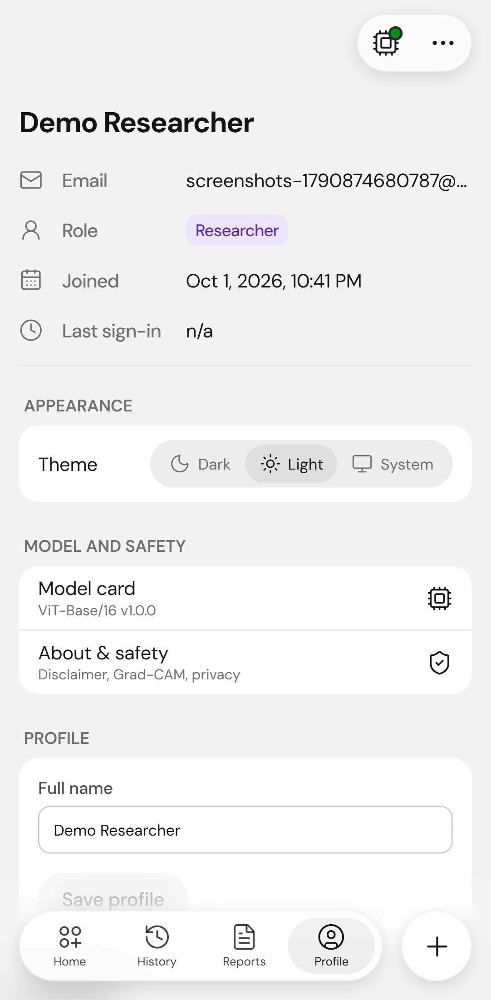 |

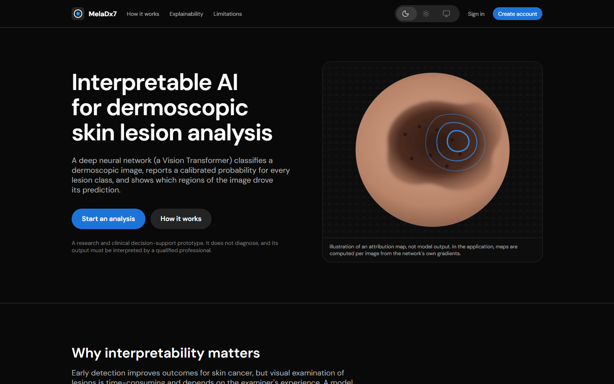

Regenerate with `tests/e2e/capture-screenshots.mjs` (see the script header).

## Architecture

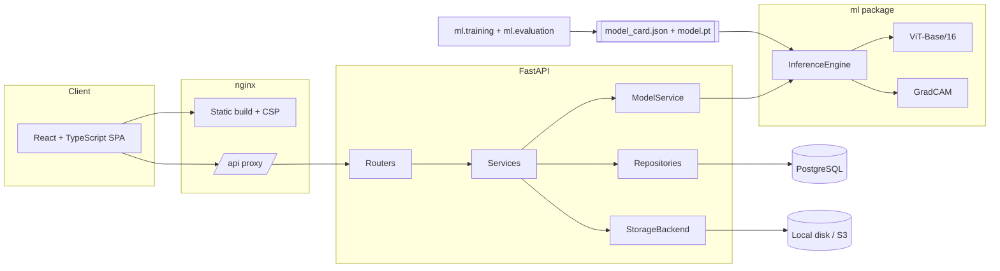

Detailed diagrams (request sequence, ER model, layering, security controls) are in
[docs/architecture.md](docs/architecture.md).

## Technology stack

| Layer | Technologies |
|---|---|
| Deep learning | PyTorch, torchvision, Hugging Face Transformers (ViT-Base/16; EfficientNet and ResNet also supported), NumPy, Pillow, scikit-learn |
| Explainability | Grad-CAM (own implementation), Turbo and single-hue colour maps |
| API | FastAPI, Pydantic v2, SQLAlchemy 2 (async), asyncpg, Alembic, PyJWT, argon2-cffi, ReportLab |
| Data | PostgreSQL 16 (SQLite for fast tests), local or S3-compatible object storage |
| Frontend | React 19, TypeScript, Vite, Tailwind CSS v4, Radix UI (shadcn-style components), TanStack Query, React Router, React Hook Form + Zod, Recharts, Lucide, DM Sans |
| Quality | pytest, Vitest + Testing Library, Playwright, Ruff, mypy, ESLint (incl. jsx-a11y) |
| Operations | Docker, Docker Compose, nginx, GitHub Actions |

## Project structure

```
.
├── ml/                         Machine-learning package (importable as `ml`)
│   ├── configs/                Training configs and class taxonomies (YAML)
│   ├── datasets/               Folder dataset, lesion-grouped split, HAM10000 preparation
│   ├── preprocessing/          Safe decoding, sanitising, transforms, quality checks
│   ├── models/                 Architecture registry (backbone, head, Grad-CAM layer)
│   ├── training/               Config, loops, calibration, reproducibility, train CLI
│   ├── evaluation/             Metrics and the evaluation CLI
│   ├── inference/              Model artifacts/cards and the InferenceEngine
│   ├── explainability/         Grad-CAM and heatmap rendering
│   ├── scripts/                Development-only pipeline-verification artifact
│   └── tests/                  80 tests (incl. a Grad-CAM localisation test and training smoke tests)
├── backend/
│   ├── app/
│   │   ├── api/                Routers, dependencies, upload handling
│   │   ├── core/               Settings, security, errors, logging, middleware, signing, rate limit
│   │   ├── db/                 Declarative base, UTC types, engine/session
│   │   ├── models/             ORM: users, refresh tokens, model versions, analyses, predictions
│   │   ├── repositories/       All SQL (history filters, statistics)
│   │   ├── schemas/            Pydantic request/response models
│   │   ├── services/           Auth, analyses, model lifecycle, stats, PDF reports, imaging
│   │   ├── storage/            StorageBackend + local and S3 implementations
│   │   ├── cli.py              create-user / promote-admin / check-model
│   │   └── main.py             Application factory
│   ├── alembic/                Migrations
│   ├── tests/                  API, auth, workflow, storage (moto), security and trained-model tests
│   └── Dockerfile
├── frontend/
│   ├── src/{api,components,context,hooks,layouts,lib,pages,routes,test}
│   ├── nginx.conf
│   └── Dockerfile
├── tests/e2e/                  Playwright end-to-end tests against the running stack
├── notebooks/                  Kaggle/Colab GPU training notebook
├── docs/                       architecture, api, model, training, deployment, explainability, openapi.json
├── data/                       (git-ignored) raw and processed datasets, local uploads
├── models/                     (git-ignored) trained model artifacts
├── docker-compose.yml
├── .env.example
├── Makefile
└── pyproject.toml              Package metadata for `ml` + Ruff/pytest/mypy config
```

## Quick start

### Docker (full stack)

```bash
cp .env.example .env     # set JWT_SECRET (openssl rand -hex 32) and POSTGRES_PASSWORD
docker compose up --build
```

Open http://localhost:8080 and create an account. The API loads the model folder named
by `MODEL_DIR` from `./models` (a trained artifact; see [Model setup](#model-setup-and-inference)).
Without one, the app says no weights are loaded and analysis is disabled; the other pages
still work. See [docs/deployment.md](docs/deployment.md) for admin accounts, HTTPS, scaling and
deploying to Render.

### Local development

```bash
python -m venv .venv && source .venv/bin/activate
make install             # CPU PyTorch + backend deps + `pip install -e .` + npm ci
cp .env.example .env     # set JWT_SECRET and DATABASE_URL (PostgreSQL)
make migrate
make api                 # http://localhost:8000/api/docs
make web                 # http://localhost:5173
```

Backend only: `cd backend && uvicorn app.main:create_app --factory --reload`.
Frontend only: `cd frontend && npm install && npm run dev` (proxies `/api` to port 8000).

## Dataset setup

The release model uses **HAM10000** (Tschandl et al., *Sci. Data* 5, 180161, 2018;
https://doi.org/10.7910/DVN/DBW86T; **CC BY-NC**), in the ISIC Archive export:
**11,719 images used** (one synthetic image excluded), 7 classes, split by lesion into
**8,369 train / 1,675 validation / 1,675 test**. The full audit, label mapping and per-class
counts are in [docs/dataset.md](docs/dataset.md). Download the data yourself and accept its
licence; none is included here.

```bash
python -m ml.datasets.prepare_ham10000 \
  --metadata data/raw/metadata.csv \
  --images data/raw/ISIC-images \
  --output data/processed
```

Both the ISIC Archive layout and the original Harvard Dataverse layout are accepted. The
split is **grouped by lesion**, so no lesion appears in more than one of
train/validation/test; the script also checks for corrupt files and duplicates and records
the class distribution in `split_summary.json`. Any other dataset works if arranged as
`data/processed/{train,validation,test}/<class_code>/` with a matching class YAML.
Details: [docs/training.md](docs/training.md).

## Model training

```bash
python -m ml.training.train --config ml/configs/vit_base.yaml      # release model
# others: ml/configs/efficientnet_b0.yaml, resnet50.yaml
# override anything: --set training.epochs=40 --set data.batch_size=64
# resume:            --resume
```

No GPU? Run `notebooks/train_ham10000_kaggle.ipynb` on Kaggle or Colab (set `CHOICE = "vit"`;
about 22 minutes on a T4).

The run writes `models/vit_base_patch16_224-v1.0.0/` with weights, model card, history, test
metrics and sample explanations.

## Model evaluation

Evaluation runs automatically after training, on the held-out test split. To re-run:

```bash
python -m ml.evaluation.evaluate --model models/vit_base_patch16_224-v1.0.0 --data data/processed
```

Reported: accuracy, balanced accuracy, top-2 accuracy, macro/weighted precision, recall,
F1, per-class sensitivity/specificity/F1/ROC-AUC, confusion matrix, ROC curves, ECE/NLL/
Brier with a reliability diagram, the derived malignant/pre-malignant screening task, and
sample predictions with Grad-CAM. The web app's Model page renders all of it.

### Results (release model, held-out test split)

Release model: **ViT-Base/16 v1.0.0**, evaluated once on the held-out, lesion-grouped test
split (1,675 images that were never used for training, checkpoint selection or
calibration). Every figure below is copied from `metrics.json` of the released artifact
(weights SHA-256 `62eaf9a7a67d11ac...`).

| Metric | Value |
|---|---|
| Accuracy | 0.8245 |
| Balanced accuracy | 0.7395 |
| Top-2 accuracy | 0.9319 |
| Macro precision / recall / F1 | 0.7433 / 0.7395 / 0.7352 |
| Weighted F1 | 0.8290 |
| Macro ROC-AUC (one-vs-rest) | 0.9188 |
| Calibration: ECE / NLL / Brier (after temperature scaling, T = 0.702) | 0.0829 / 0.6474 / 0.2796 |
| Malignant or pre-malignant classes combined vs. rest (akiec + bcc + mel, 329 positives): sensitivity / specificity at 0.5, ROC-AUC | 0.766 / 0.904, 0.918 |

| Class | Test images | Recall (sensitivity) | Precision | Specificity | F1 | ROC-AUC |
|---|---|---|---|---|---|---|
| akiec (Actinic keratosis / intraepithelial carcinoma) | 54 | 0.667 | 0.581 | 0.984 | 0.621 | 0.941 |
| bcc (Basal cell carcinoma) | 89 | 0.685 | 0.753 | 0.987 | 0.718 | 0.955 |
| bkl (Benign keratosis-like lesion) | 192 | 0.656 | 0.700 | 0.964 | 0.677 | 0.917 |
| df (Dermatofibroma) | 23 | 0.565 | 0.812 | 0.998 | 0.667 | 0.728 |
| mel (Melanoma) | 186 | 0.710 | 0.532 | 0.922 | 0.608 | 0.935 |
| nv (Melanocytic nevus) | 1106 | 0.893 | 0.932 | 0.874 | 0.912 | 0.955 |
| vasc (Vascular lesion) | 25 | 1.000 | 0.893 | 0.998 | 0.943 | 1.000 |

Training run: 12 epochs (early stopping, best epoch 8) on a
Kaggle GPU, about 22 minutes, seed 42, class-weighted loss. Fine-tuned from Google's
public ImageNet-21k ViT-Base/16 weights.

**How to read these numbers.**

* They are evaluation results on one public dataset, not guarantees about any individual
  image, patient or clinic.
* Melanoma recall is 0.71 but its precision is only 0.53: about half of the images
  the model calls melanoma are not, and 36 of 186 true melanomas were called
  nevus. 81 nevi were called melanoma.
* Dermatofibroma (23 images), vascular lesion (25) and akiec (54) have very few
  test images, so their per-class numbers are noisy.
* Probabilities are over-confident in the highest bin: among the 306 test images with
  confidence above 0.93, top-1 accuracy was 0.82.
* The gap between training accuracy (97.6% in the last epoch) and validation accuracy
  (82.6%) shows the model overfits; more data, stronger augmentation or ensembling would
  be the next steps.
* Not clinically validated. Not a medical device. Outputs are never a diagnosis.

Full detail: [docs/model.md](docs/model.md#results).

**The weights are not stored in git** (`models/` is ignored; the file is ~330 MB and derived from
CC BY-NC data). Put the artifact in `models/` or set `MODEL_URL` for the Docker build
(see [docs/deployment.md](docs/deployment.md)).

## Model setup and inference

```bash
# .env
MODEL_PATH=models/vit_base_patch16_224-v1.0.0
```

Restart the API or call `POST /api/model/reload` as an admin. Inference then runs:

- in the web app (New analysis), or
- via the API: `POST /api/analyses` (stored), `POST /api/predict` and `POST /api/explain`
  (stateless), or
- in Python:

```python
from PIL import Image
from ml.inference import InferenceEngine

engine = InferenceEngine.from_path("models/vit_base_patch16_224-v1.0.0")
image = Image.open("lesion.jpg").convert("RGB")
result = engine.predict(image)
print(result.predicted.name, result.confidence, result.uncertain)
explanation = engine.explain(image, result.predicted_index)   # explanation.cam.cam: HxW in [0, 1]
```

For UI development without weights, `make dev-model` creates a randomly initialised
artifact. It is accepted only with `ALLOW_UNTRAINED_MODEL=true` outside production and is
labelled as meaningless on every screen and report. It is never used by the release.

## API

OpenAPI docs at `/api/docs`. Main endpoints:

```
POST /api/auth/register | /login | /refresh | /logout      GET /api/auth/me
POST /api/analyses        GET /api/analyses        GET|DELETE /api/analyses/{id}
POST /api/analyses/{id}/predictions                GET /api/analyses/{id}/explanations/{class}
GET  /api/analyses/{id}/report
POST /api/predict         POST /api/explain
GET  /api/model/info      GET /api/model/metrics   GET /api/model/inference-stats
GET  /api/stats/overview  GET /api/health
```

Full reference, error codes and examples: [docs/api.md](docs/api.md).

## Grad-CAM in one paragraph

For the predicted (or any chosen) class, Grad-CAM takes the gradient of the class score
with respect to the last feature maps (for the ViT: the patch tokens entering the last
transformer block, reshaped to a 14 x 14 grid), averages it per channel to get each
channel's importance, weights the feature maps by it, sums them, keeps positive values and
upsamples the result to the image. Bright regions are where features that raised the class
score were found. The maps are coarse (14 x 14 patches for the ViT), relative within one image, and show
correlation, not causation. As the UI states: *the highlighted regions indicate areas that
contributed strongly to the model's prediction. They are model-attribution visualizations
and should not be interpreted as definitive clinical evidence.* More in
[docs/explainability.md](docs/explainability.md).

## Testing

```bash
make test            # ML + backend + frontend
make test-ml         # pytest ml/tests
make test-api        # pytest backend/tests (SQLite); TEST_DATABASE_URL=postgresql+asyncpg://... for PostgreSQL
make test-web        # Vitest component and workflow tests
make e2e             # Playwright against a running stack (tests/e2e)
make lint typecheck  # Ruff, mypy, ESLint, tsc
```

| Suite | What it covers |
|---|---|
| ML (85) | Taxonomy validation, decoding and validation edge cases, EXIF handling, metadata stripping, transforms, quality checks, every architecture, Grad-CAM localisation correctness, rendering, inference determinism, checksum and path-safety of artifacts, metrics vs scikit-learn, ECE, temperature scaling, lesion-grouped splits without leakage, dataset preparation, training/resume/evaluation smoke runs |
| Backend (97; 1 symlink test skips where symlinks need elevation, e.g. Windows; run on SQLite and PostgreSQL) | Upload -> prediction -> explanation -> save -> retrieve -> report -> delete; reproducibility from the stored image; per-user isolation; validation errors (415/413/422); history search/filter/sort/pagination; auth (rotation, reuse detection, grace window, JWT tampering, `alg=none`, expiry, rate limits); model unavailable/untrained states; a real trained model's metrics; model upgrade and re-run; account deletion; storage (local, traversal, symlinks, S3 via moto); signed URLs; settings guards; security headers; body-size limits |
| Frontend (43) | API client refresh/retry and error mapping, uploader validation, probability chart, prediction card, Grad-CAM viewer controls, sign-in flow with redirect, analyse -> result workflow, class explanation, untrained and not-found states |
| E2E (13) | In Chrome against the real API, database and model: the full workflow (upload, predict, explain, save, retrieve, report, delete); Light / Dark / System theme applied at once, persisted across reloads and sign-out/sign-in, and following the OS; every page at phone, tablet and desktop widths in both themes with no horizontal overflow and no console errors; access control; invalid uploads; account deletion; phone tab bar and result sheet; regressions for the landing header alignment, sidebar search clipping, compact account-menu rows, result-card spacing and light-theme menu dividers. Runs against the dev stack or the production Docker stack (`E2E_BASE_URL=http://localhost:8080`); set `E2E_LESION_IMAGE` to a real test-split image |
| Live acceptance journey (32 steps) | `python tests/acceptance/journey.py --base <url>`: register, login, real-image upload, prediction, uncertainty, provenance, Grad-CAM, history, PDF content, refresh rotation, logout, account deletion and protected routes, against a running stack with the real model |

## Security

Argon2id password hashing; 15-minute access JWTs kept in memory; opaque, hashed,
rotating refresh tokens in an httpOnly SameSite=Strict cookie with reuse detection;
CORS allow-list; streaming request-size cap; content-based file validation; metadata
stripping; server-generated storage keys with traversal protection; signed expiring file
URLs; SHA-256-verified, pickle-free model loading; uniform errors without stack traces or
echoed input; rate limiting; security headers and CSP; secrets only from the environment,
with weak or placeholder secrets rejected. See the table in
[docs/architecture.md](docs/architecture.md#security-summary).

## Limitations

- Not clinically validated; not a medical device; outputs are not diagnoses.
- Trained on one public dataset. HAM10000 comes from a limited set of centres and
  predominantly lighter skin types; performance elsewhere is unknown. The weights are
  derived from CC BY-NC data: **non-commercial use only**.
- Modest accuracy: 82.5% overall, melanoma precision 0.53 and recall 0.71 on the test
  split; over-confident at high confidence. See [Results](#results-release-model-held-out-test-split).
- Closed-set: every image is assigned to one of the trained classes, even if it shows
  something else. Uncertainty flags are heuristics, not out-of-distribution detection.
- Calibration is fitted on the same dataset's validation split.
- Grad-CAM is coarse and model-centric; it cannot prove what the model "understood".
- The in-memory rate limiter is per process (use Redis for multiple replicas).

## Ethical considerations

- **Human in the loop.** The interface never states a diagnosis, shows every class
  probability, flags uncertainty and repeats the disclaimer on every result and report.
- **Fairness.** Evaluate per skin type and per centre before any real-world use; the
  default dataset under-represents darker skin.
- **Privacy.** Images are stripped of metadata, stored under random keys and visible only
  to their owner. Users can delete any analysis, or their whole account and all its data. Do not upload identifiable images. Real clinical use would
  need a data-protection assessment and appropriate consent.
- **Transparency.** Each result records the model version, weights hash, preprocessing
  and calibration; metrics are bound to the weights they describe.
- **Licensing.** HAM10000 is CC BY-NC 4.0: models trained on it should be used and shared
  for non-commercial purposes only, with attribution.

## Future improvements

- Train and compare EfficientNet-B3/ConvNeXt; test-time augmentation; ensembles.
- Out-of-distribution detection (e.g. energy scores) and a "not a dermoscopic image" gate.
- Additional XAI methods (Grad-CAM++, Score-CAM, integrated gradients) and sanity checks.
- Lesion segmentation to quantify attribution inside vs outside the lesion.
- External validation (ISIC 2019/2020, PAD-UFES-20), per-skin-type reporting.
- Clinician feedback on predictions to build a review workflow; audit log export.
- Redis-backed rate limiting and a dedicated inference worker queue.

## Project team

Major project, Vidya Jyothi Institute of Technology, Hyderabad (Batch 5):
P Durga Prasad, Koudampally Varsha, M Anirva, Milith Singh.
Guide: Mrs. M. Vijaya. Coordinators: Dr. Ch. Deepika, Mr. PKVS Sarma.

## Licence

Source code: MIT (see `LICENSE`). Datasets and any weights trained on them are subject to
the dataset's own licence (HAM10000: CC BY-NC 4.0).

## License and credits

* **Code:** MIT, see [LICENSE](LICENSE). Copyright (c) 2026 anirva09.
* **Trained weights:** derived from HAM10000 (CC BY-NC). The weights are therefore for
  **non-commercial** use only, with attribution, even though the code is MIT.
* **Dataset:** Tschandl P., Rosendahl C., Kittler H. The HAM10000 dataset, a large collection of
  multi-source dermatoscopic images of common pigmented skin lesions. *Sci. Data* 5, 180161
  (2018). https://doi.org/10.7910/DVN/DBW86T. Images via the ISIC Archive.
* **Base model:** Vision Transformer ViT-Base/16, Dosovitskiy et al., "An Image is Worth 16x16
  Words", ICLR 2021. Initial weights: `google/vit-base-patch16-224-in21k` (Apache-2.0), served
  through Hugging Face Transformers.
* **Project:** dataset preparation, lesion-grouped split, training and evaluation of the release
  model, and the MelaDx7 application were done by the project author (anirva09).
* The screenshots show images from the HAM10000 test split (CC BY-NC).
