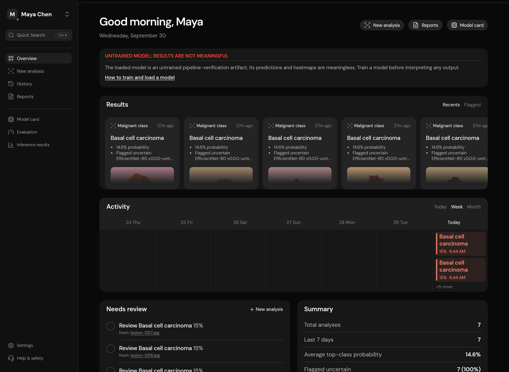
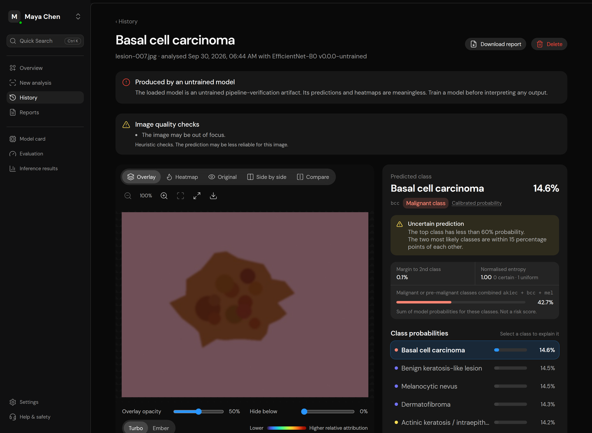
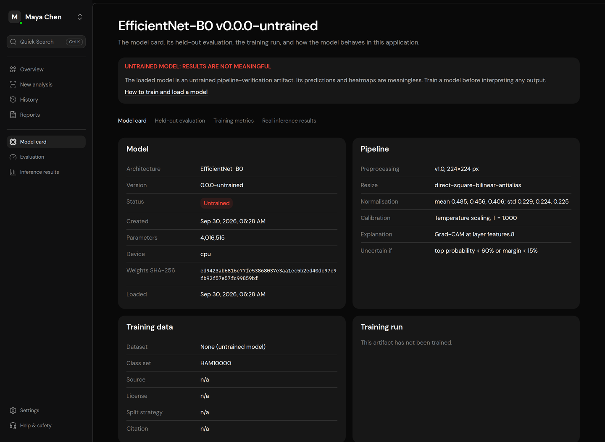
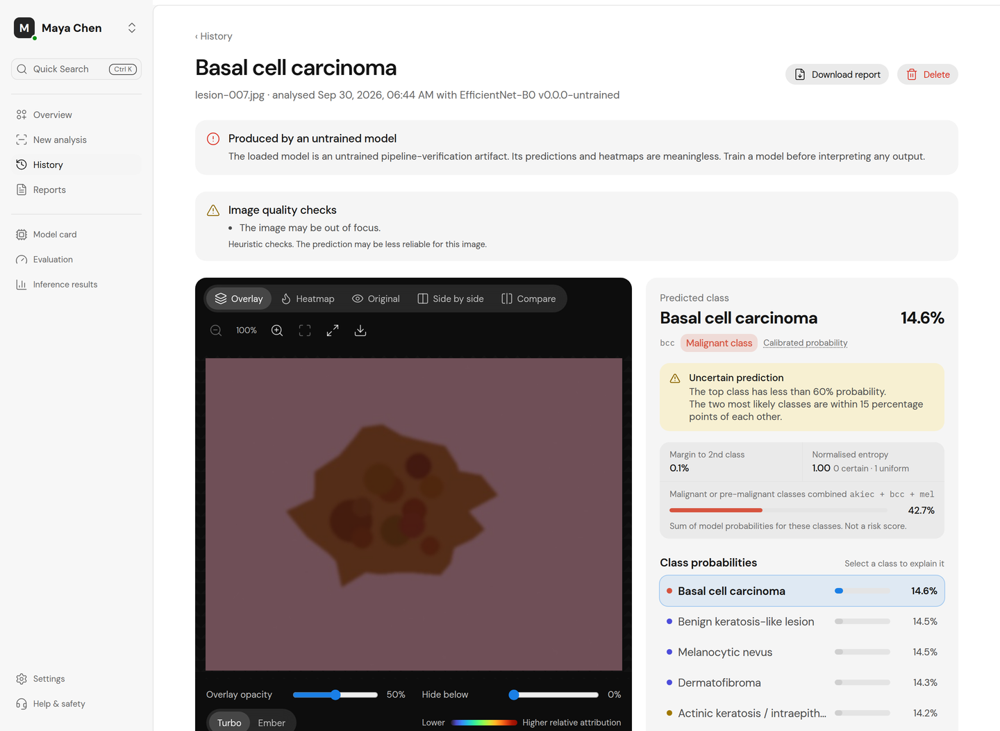
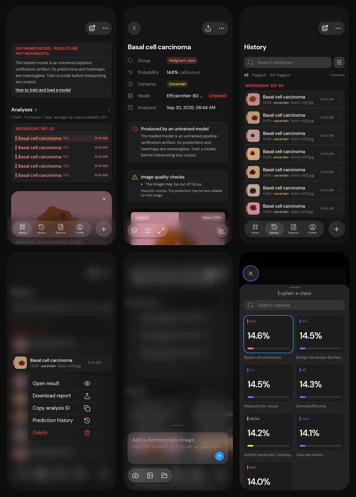
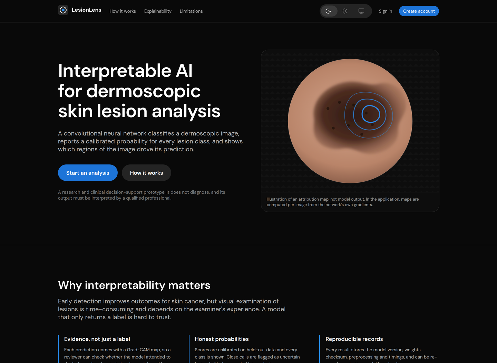
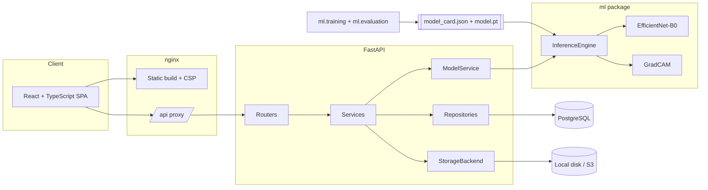

# LesionLens

**Interpretable Deep Learning for Skin Cancer Detection and Subtype Classification**

LesionLens analyses dermoscopic skin-lesion images with a convolutional neural network,
reports a calibrated probability for every lesion class, and explains each prediction
with a Grad-CAM heatmap of the image regions that drove it. It is a complete system:
training pipeline, versioned model artifacts, a FastAPI inference service with
PostgreSQL, and a React web application.

> **Medical disclaimer.** This AI system provides an assistive prediction and
> visualization. It is not a medical diagnosis and should not replace evaluation by a
> qualified healthcare professional. LesionLens is a research and education prototype,
> not a medical device. It gives no treatment recommendations.

---

## Contents

[Problem](#problem-statement) · [Features](#features) · [Screenshots](#screenshots) ·
[Architecture](#architecture) · [Stack](#technology-stack) · [Structure](#project-structure) ·
[Quick start](#quick-start) · [Dataset](#dataset-setup) · [Training](#model-training) ·
[Evaluation](#model-evaluation) · [Inference](#model-setup-and-inference) ·
[API](#api) · [Grad-CAM](#grad-cam-in-one-paragraph) · [Testing](#testing) ·
[Security](#security) · [Limitations](#limitations) · [Ethics](#ethical-considerations) ·
[Roadmap](#future-improvements)

## Problem statement

Skin cancer is among the most common cancers, and early detection improves outcomes.
Visual examination of lesions is time-consuming and depends on the examiner's expertise.
Deep learning can classify dermoscopic images, but a label on its own is hard to trust:
a reviewer cannot tell whether the model looked at the lesion or at a ruler, hair or an
ink marking.

This project pairs a CNN classifier with explainable AI. For every image it returns the
predicted class, a calibrated probability for each class, an uncertainty assessment, and
a Grad-CAM map for any class, and it records exactly which model produced the result, so
a clinician or researcher can inspect, question and reproduce it.

## Features

**Analysis**
- Drag-and-drop upload with client and server validation (type by content, size,
  integrity, dimensions, decompression bombs); EXIF/GPS metadata is stripped.
- Probability for every class, predicted class and calibrated confidence (temperature
  scaling), uncertainty flags (low top probability, small margin, entropy).
- Combined probability of malignant/pre-malignant classes, labelled as a model-output
  sum, never a risk score.
- Heuristic image-quality warnings (resolution, exposure, contrast, focus).

**Explainable AI**
- Grad-CAM implemented from scratch with correctness tests.
- Viewer with overlay, heatmap, original, side-by-side and draggable comparison views;
  opacity, attribution threshold, two colour maps, zoom/pan (mouse, touch, keyboard),
  PNG download.
- Explanation for **any class** on demand, not just the predicted one.

**Records and reporting**
- History with search, class/probability/uncertainty/date filters, sorting, pagination.
- Report page with model version, weights SHA-256, preprocessing, calibration, timings
  and image hash; PDF report export.
- Re-run an analysis with a newer model; every model version's prediction is kept.
- Delete a single analysis, or the whole account with all images, maps and records.

**Model lifecycle (MLOps-ready)**
- Config-driven training: lesion-grouped stratified split, augmentation, class-imbalance
  handling, staged fine-tuning, warm-up + cosine LR, early stopping, checkpoint/resume,
  temperature calibration, held-out evaluation with per-class metrics, confusion matrix,
  ROC curves, calibration and a sample gallery.
- Versioned artifacts with a JSON model card; weights verified by SHA-256 and loaded with
  `weights_only=True`. Architecture and classes come from the card, so models swap
  without code changes.
- Model page separating **held-out evaluation**, **training metrics** and **real
  inference statistics**.

**Platform**
- JWT access tokens + rotating httpOnly refresh cookies with reuse detection; Argon2id.
- Local or S3-compatible storage behind one interface; signed, expiring image URLs.
- Structured JSON logs with request IDs; health checks; rate limits; security headers; CSP.
- Interface built to the product's Figma reference: a desktop dashboard with sidebar and
  quick search, and a separate native-feeling phone design (floating glass tab bar with an
  analyse button, bottom sheets, long-press menus, swipe-to-delete, pull-to-refresh, pinch
  zoom and swipe comparison, safe areas). Keyboard accessible; dark by default, light opt-in.
- Docker Compose deployment, CI workflow, 222 automated tests (ML, API, UI, browser end-to-end).

**Honest by construction:** no bundled or fabricated dataset, no hard-coded predictions,
metrics or heatmaps. Without trained weights the app runs and says so; metrics are shown
only if they were computed for the exact loaded weights.

## Screenshots

The screenshots below were taken with an **untrained** pipeline-verification model
(randomly initialised), so the predictions and heatmaps shown are meaningless and the UI
marks them as such. Replace them with screenshots from your trained model.

| Desktop home | Analysis result |
|---|---|
|  |  |

| Model card and evaluation | Light theme |
|---|---|
|  |  |

**Phone:** home, result with swipe comparison, history, long-press menu, the "+" composer
and the class sheet.





<!-- After training, add: docs/screenshots/trained-result.png and docs/screenshots/evaluation.png -->

## Architecture



Detailed diagrams (request sequence, ER model, layering, security controls) are in
[docs/architecture.md](docs/architecture.md).

## Technology stack

| Layer | Technologies |
|---|---|
| Deep learning | PyTorch, torchvision (EfficientNet-B0 / ResNet), NumPy, Pillow, scikit-learn |
| Explainability | Grad-CAM (own implementation), Turbo and single-hue colour maps |
| API | FastAPI, Pydantic v2, SQLAlchemy 2 (async), asyncpg, Alembic, PyJWT, argon2-cffi, ReportLab |
| Data | PostgreSQL 16 (SQLite for fast tests), local or S3-compatible object storage |
| Frontend | React 19, TypeScript, Vite, Tailwind CSS v4, Radix UI (shadcn-style components), TanStack Query, React Router, React Hook Form + Zod, Recharts, Lucide, DM Sans |
| Quality | pytest, Vitest + Testing Library, Playwright, Ruff, mypy, ESLint (incl. jsx-a11y) |
| Operations | Docker, Docker Compose, nginx, GitHub Actions |

## Project structure

```
.
├── ml/                         Machine-learning package (importable as `ml`)
│   ├── configs/                Training configs and class taxonomies (YAML)
│   ├── datasets/               Folder dataset, lesion-grouped split, HAM10000 preparation
│   ├── preprocessing/          Safe decoding, sanitising, transforms, quality checks
│   ├── models/                 Architecture registry (backbone, head, Grad-CAM layer)
│   ├── training/               Config, loops, calibration, reproducibility, train CLI
│   ├── evaluation/             Metrics and the evaluation CLI
│   ├── inference/              Model artifacts/cards and the InferenceEngine
│   ├── explainability/         Grad-CAM and heatmap rendering
│   ├── scripts/                Untrained pipeline-verification artifact
│   └── tests/                  80 tests (incl. a Grad-CAM localisation test and training smoke tests)
├── backend/
│   ├── app/
│   │   ├── api/                Routers, dependencies, upload handling
│   │   ├── core/               Settings, security, errors, logging, middleware, signing, rate limit
│   │   ├── db/                 Declarative base, UTC types, engine/session
│   │   ├── models/             ORM: users, refresh tokens, model versions, analyses, predictions
│   │   ├── repositories/       All SQL (history filters, statistics)
│   │   ├── schemas/            Pydantic request/response models
│   │   ├── services/           Auth, analyses, model lifecycle, stats, PDF reports, imaging
│   │   ├── storage/            StorageBackend + local and S3 implementations
│   │   ├── cli.py              create-user / promote-admin / check-model
│   │   └── main.py             Application factory
│   ├── alembic/                Migrations
│   ├── tests/                  API, auth, workflow, storage (moto), security and trained-model tests
│   └── Dockerfile
├── frontend/
│   ├── src/{api,components,context,hooks,layouts,lib,pages,routes,test}
│   ├── nginx.conf
│   └── Dockerfile
├── tests/e2e/                  Playwright end-to-end tests against the running stack
├── notebooks/                  Kaggle/Colab GPU training notebook
├── docs/                       architecture, api, model, training, deployment, explainability, openapi.json
├── data/                       (git-ignored) raw and processed datasets, local uploads
├── models/                     (git-ignored) trained model artifacts
├── docker-compose.yml
├── .env.example
├── Makefile
└── pyproject.toml              Package metadata for `ml` + Ruff/pytest/mypy config
```

## Quick start

### Docker (full stack)

```bash
cp .env.example .env     # set JWT_SECRET (openssl rand -hex 32) and POSTGRES_PASSWORD
docker compose up --build
```

Open http://localhost:8080 and create an account. Until a trained model is placed in
`./models` (see below), the app explains that no weights are loaded and analysis is
disabled; history, reports and all other pages work. See
[docs/deployment.md](docs/deployment.md) for trying the workflow with an untrained model,
admin accounts, HTTPS and scaling.

### Local development

```bash
python -m venv .venv && source .venv/bin/activate
make install             # CPU PyTorch + backend deps + `pip install -e .` + npm ci
cp .env.example .env     # set JWT_SECRET and DATABASE_URL (PostgreSQL)
make migrate
make api                 # http://localhost:8000/api/docs
make web                 # http://localhost:5173
```

Backend only: `cd backend && uvicorn app.main:create_app --factory --reload`.
Frontend only: `cd frontend && npm install && npm run dev` (proxies `/api` to port 8000).

## Dataset setup

The default configuration targets **HAM10000** (10,015 dermatoscopic images, 7
categories; Harvard Dataverse, https://doi.org/10.7910/DVN/DBW86T; **CC BY-NC 4.0**;
Tschandl et al., *Sci. Data* 5, 180161, 2018). Download it yourself and accept its
licence; no data is included here.

```bash
python -m ml.datasets.prepare_ham10000 \
  --metadata data/raw/HAM10000_metadata.csv \
  --images data/raw/HAM10000_images_part_1 data/raw/HAM10000_images_part_2 \
  --output data/processed
```

The split is **grouped by lesion** (several images show the same lesion), so no lesion
appears in more than one of train/validation/test. Any other dataset works if arranged as
`data/processed/{train,validation,test}/<class_code>/` with a matching class YAML.
Details: [docs/training.md](docs/training.md).

## Model training

```bash
python -m ml.training.train --config ml/configs/efficientnet_b0.yaml
# override anything: --set training.epochs=40 --set data.batch_size=64
# resume:            --resume
```

No GPU? Run `notebooks/train_ham10000_kaggle.ipynb` on Kaggle or Colab.

The run writes `models/efficientnet_b0-v1.0.0/` with weights, model card, history, test
metrics and sample explanations.

## Model evaluation

Evaluation runs automatically after training, on the held-out test split. To re-run:

```bash
python -m ml.evaluation.evaluate --model models/efficientnet_b0-v1.0.0 --data data/processed
```

Reported: accuracy, balanced accuracy, top-2 accuracy, macro/weighted precision, recall,
F1, per-class sensitivity/specificity/F1/ROC-AUC, confusion matrix, ROC curves, ECE/NLL/
Brier with a reliability diagram, the derived malignant/pre-malignant screening task, and
sample predictions with Grad-CAM. The web app's Model page renders all of it.

**No trained weights or results are included in this repository and none are claimed.**
Numbers appear only after you train.

## Model setup and inference

```bash
# .env
MODEL_PATH=models/efficientnet_b0-v1.0.0
```

Restart the API or call `POST /api/model/reload` as an admin. Inference then runs:

- in the web app (New analysis), or
- via the API: `POST /api/analyses` (stored), `POST /api/predict` and `POST /api/explain`
  (stateless), or
- in Python:

```python
from PIL import Image
from ml.inference import InferenceEngine

engine = InferenceEngine.from_path("models/efficientnet_b0-v1.0.0")
image = Image.open("lesion.jpg").convert("RGB")
result = engine.predict(image)
print(result.predicted.name, result.confidence, result.uncertain)
explanation = engine.explain(image, result.predicted_index)   # explanation.cam.cam: HxW in [0, 1]
```

For UI development before training: `make dev-model` creates an **untrained** artifact,
accepted only with `ALLOW_UNTRAINED_MODEL=true` outside production and labelled as
meaningless on every screen and report.

## API

OpenAPI docs at `/api/docs`. Main endpoints:

```
POST /api/auth/register | /login | /refresh | /logout      GET /api/auth/me
POST /api/analyses        GET /api/analyses        GET|DELETE /api/analyses/{id}
POST /api/analyses/{id}/predictions                GET /api/analyses/{id}/explanations/{class}
GET  /api/analyses/{id}/report
POST /api/predict         POST /api/explain
GET  /api/model/info      GET /api/model/metrics   GET /api/model/inference-stats
GET  /api/stats/overview  GET /api/health
```

Full reference, error codes and examples: [docs/api.md](docs/api.md).

## Grad-CAM in one paragraph

For the predicted (or any chosen) class, Grad-CAM takes the gradient of the class score
with respect to the last convolutional feature maps, averages it per channel to get each
channel's importance, weights the feature maps by it, sums them, keeps positive values and
upsamples the result to the image. Bright regions are where features that raised the class
score were found. The maps are coarse (7 x 7), relative within one image, and show
correlation, not causation. As the UI states: *the highlighted regions indicate areas that
contributed strongly to the model's prediction. They are model-attribution visualizations
and should not be interpreted as definitive clinical evidence.* More in
[docs/explainability.md](docs/explainability.md).

## Testing

```bash
make test            # ML + backend + frontend
make test-ml         # pytest ml/tests
make test-api        # pytest backend/tests (SQLite); TEST_DATABASE_URL=postgresql+asyncpg://... for PostgreSQL
make test-web        # Vitest component and workflow tests
make e2e             # Playwright against a running stack (tests/e2e)
make lint typecheck  # Ruff, mypy, ESLint, tsc
```

| Suite | What it covers |
|---|---|
| ML (80) | Taxonomy validation, decoding and validation edge cases, EXIF handling, metadata stripping, transforms, quality checks, every architecture, Grad-CAM localisation correctness, rendering, inference determinism, checksum and path-safety of artifacts, metrics vs scikit-learn, ECE, temperature scaling, lesion-grouped splits without leakage, dataset preparation, training/resume/evaluation smoke runs |
| Backend (93, run on SQLite and PostgreSQL) | Upload -> prediction -> explanation -> save -> retrieve -> report -> delete; reproducibility from the stored image; per-user isolation; validation errors (415/413/422); history search/filter/sort/pagination; auth (rotation, reuse detection, grace window, JWT tampering, `alg=none`, expiry, rate limits); model unavailable/untrained states; a real trained model's metrics; model upgrade and re-run; account deletion; storage (local, traversal, symlinks, S3 via moto); signed URLs; settings guards; security headers; body-size limits |
| Frontend (30) | API client refresh/retry and error mapping, uploader validation, probability chart, prediction card, Grad-CAM viewer controls, sign-in flow with redirect, analyse -> result workflow, class explanation, untrained and not-found states |
| E2E (5) | Full workflow in Chrome against the real API, database and model; access control; invalid uploads; account deletion; no horizontal overflow on a phone |

## Security

Argon2id password hashing; 15-minute access JWTs kept in memory; opaque, hashed,
rotating refresh tokens in an httpOnly SameSite=Strict cookie with reuse detection;
CORS allow-list; streaming request-size cap; content-based file validation; metadata
stripping; server-generated storage keys with traversal protection; signed expiring file
URLs; SHA-256-verified, pickle-free model loading; uniform errors without stack traces or
echoed input; rate limiting; security headers and CSP; secrets only from the environment,
with weak or placeholder secrets rejected. See the table in
[docs/architecture.md](docs/architecture.md#security-summary).

## Limitations

- Not clinically validated; not a medical device; outputs are not diagnoses.
- Trained on one public dataset. HAM10000 comes from a limited set of centres and
  predominantly lighter skin types; performance elsewhere is unknown.
- Closed-set: every image is assigned to one of the trained classes, even if it shows
  something else. Uncertainty flags are heuristics, not out-of-distribution detection.
- Calibration is fitted on the same dataset's validation split.
- Grad-CAM is coarse and model-centric; it cannot prove what the model "understood".
- The in-memory rate limiter is per process (use Redis for multiple replicas).

## Ethical considerations

- **Human in the loop.** The interface never states a diagnosis, shows every class
  probability, flags uncertainty and repeats the disclaimer on every result and report.
- **Fairness.** Evaluate per skin type and per centre before any real-world use; the
  default dataset under-represents darker skin.
- **Privacy.** Images are stripped of metadata, stored under random keys and visible only
  to their owner. Users can delete any analysis, or their whole account and all its data. Do not upload identifiable images. Real clinical use would
  need a data-protection assessment and appropriate consent.
- **Transparency.** Each result records the model version, weights hash, preprocessing
  and calibration; metrics are bound to the weights they describe.
- **Licensing.** HAM10000 is CC BY-NC 4.0: models trained on it should be used and shared
  for non-commercial purposes only, with attribution.

## Future improvements

- Train and compare EfficientNet-B3/ConvNeXt; test-time augmentation; ensembles.
- Out-of-distribution detection (e.g. energy scores) and a "not a dermoscopic image" gate.
- Additional XAI methods (Grad-CAM++, Score-CAM, integrated gradients) and sanity checks.
- Lesion segmentation to quantify attribution inside vs outside the lesion.
- External validation (ISIC 2019/2020, PAD-UFES-20), per-skin-type reporting.
- Clinician feedback on predictions to build a review workflow; audit log export.
- Redis-backed rate limiting and a dedicated inference worker queue.

## Project team

Major project, Vidya Jyothi Institute of Technology, Hyderabad (Batch 5):
P Durga Prasad, Koudampally Varsha, M Anirva, Milith Singh.
Guide: Mrs. M. Vijaya. Coordinators: Dr. Ch. Deepika, Mr. PKVS Sarma.

## Licence

Source code: MIT (see `LICENSE`). Datasets and any weights trained on them are subject to
the dataset's own licence (HAM10000: CC BY-NC 4.0).
