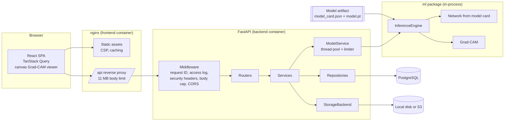
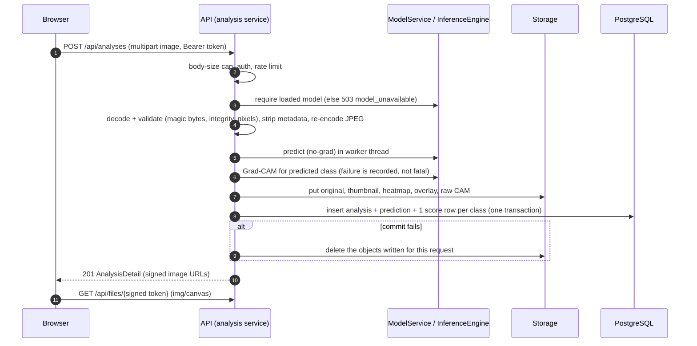
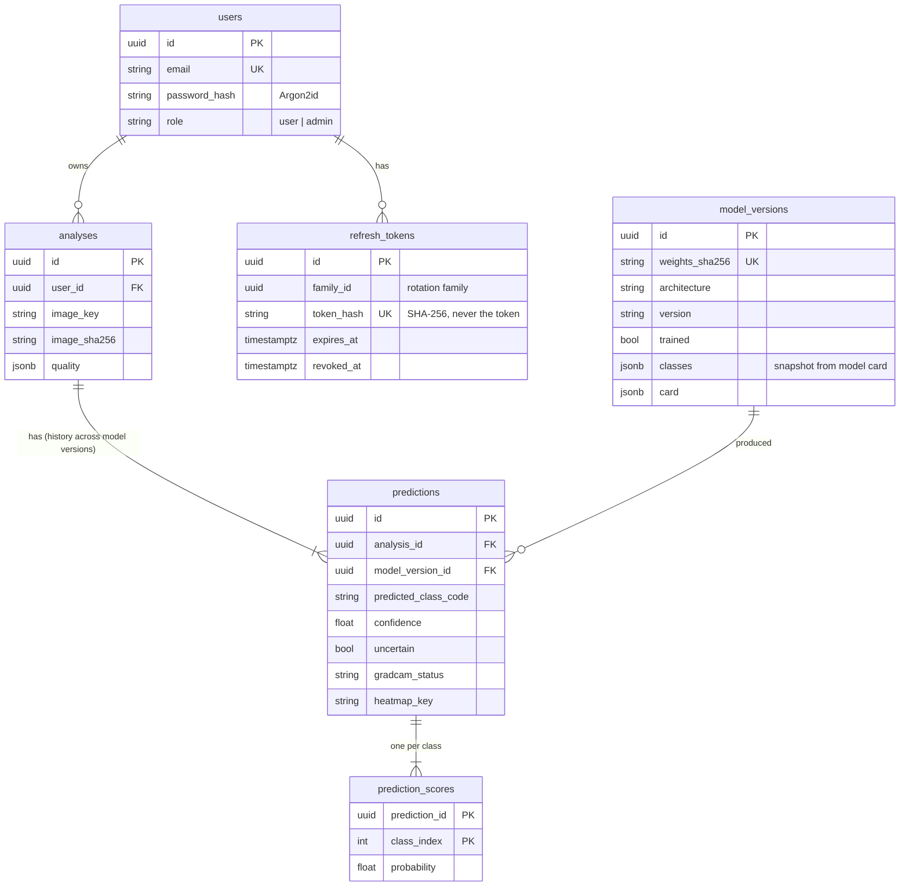

# Architecture

MelaDx7 is a monorepo with three independently testable parts and one deployment
unit per runtime:

| Part | Path | Responsibility |
|---|---|---|
| ML package | `ml/` | Data preparation, training, calibration, evaluation, inference engine, Grad-CAM |
| API | `backend/` | Auth, validation, orchestration, persistence, storage, reports |
| Web app | `frontend/` | All user-facing screens; renders only what the API returns |

The API imports `ml` as a library. The only ML surface it touches is
`ml.inference.InferenceEngine` (plus preprocessing helpers), so the network architecture,
class list and preprocessing can change by training a new artifact, without API changes.

## System overview



## Backend layering

```
app/api/routers/*    HTTP only: parse/validate input, call a service, shape the response
app/services/*       Workflow and business rules (auth, analysis, stats, reports, model)
app/repositories/*   All SQL. No other layer builds queries.
app/models/*         SQLAlchemy ORM tables
app/schemas/*        Pydantic request/response models (the OpenAPI contract)
app/storage/*        StorageBackend interface + local and S3 implementations
app/core/*           Settings, security, errors, logging, middleware, signing, rate limits
```

Route handlers never touch the database or the file system directly.

## Analysis request flow



Inference runs on the **stored, re-encoded** image, so any analysis can be reproduced
bit-for-bit from its stored file and model version (tested in
`backend/tests/test_analyses.py::test_inference_is_reproducible_from_stored_image`).

## Data model



Design decisions:

* **Analysis vs prediction.** An analysis is the image and its context; a prediction is
  one model version's output for it. Re-running an analysis with a newer model adds a
  prediction and keeps the old one.
* **Normalised scores.** The full distribution is stored as rows, not a JSON blob.
  `predictions.predicted_class_code` and `confidence` intentionally duplicate the top row
  so history filtering and sorting use single indexed columns.
* **Model snapshot.** `model_versions.classes` stores the class list from the model card,
  so historical results render with the names of the model that produced them.
* **Latest prediction per analysis** is selected with a window function
  (`row_number() over (partition by analysis_id ...)`), portable across PostgreSQL and
  SQLite.
* **Timestamps** are timezone-aware UTC everywhere (a `UTCDateTime` type decorator
  enforces this even on SQLite).

Migrations live in `backend/alembic/versions`; `alembic check` passes against the models.

## Storage

`StorageBackend` (`backend/app/storage/base.py`) has two implementations:

* `LocalStorage`: atomic writes (temp file + rename), key validation, and a resolved-path
  check that blocks traversal and symlink escapes.
* `S3Storage`: any S3-compatible service; server-side encryption on upload; tested with
  `moto`.

Keys are generated by the server (`analyses/{uuid}/...`) and never contain user input.
Browsers load images through `/api/files/{token}`, where the token is an HMAC-signed,
expiring, namespaced reference to a key (see `app/core/signing.py`). Buckets therefore
stay private, and image URLs work in `` tags without exposing bearer tokens.

## Model service

* Loads the artifact at `MODEL_PATH` at startup (and on `POST /api/model/reload`).
* Verifies the weights' SHA-256 against the model card and loads them with
  `torch.load(weights_only=True)`.
* Refuses untrained pipeline-verification artifacts unless `ALLOW_UNTRAINED_MODEL=true`
  (rejected in production).
* Registers the version in `model_versions` (idempotent, keyed by weights hash).
* Runs inference in a worker thread with a concurrency limiter so the event loop stays
  responsive.

If no model is available the API keeps serving history, reports and the dashboard, and
inference endpoints return `503 model_unavailable` with setup instructions.

## Frontend

```
src/api/            fetch client (token in memory, single-flight refresh), typed endpoints, query hooks
src/context/        AuthProvider (session restore from refresh cookie), ThemeProvider
src/layouts/        App shell (desktop sidebar or phone chrome), auth layout
src/pages/          Landing, auth, Home, Analyze, History, result, Reports, Profile, Model
src/components/
  shell/            Sidebar, QuickSearch (Ctrl/Cmd+K), MobileTabBar, MobileTopBar, BottomToolbar,
                    Composer ("+" action), glass buttons, FixedChrome portal, AboutSheet
  analysis/         ActivityList, ActivityTimeline, ResultNoteCard, ReviewList, AnalysisRow,
                    LatestResultCard, SummaryRows, AnalysisMenu (long-press actions)
  ui/               BottomSheet, LongPressMenu, SwipeRow, PullIndicator, page/section primitives,
                    buttons, inputs, menus, dialogs
  GradCAMViewer     stage (gestures), controls, full screen, desktop composite
src/hooks/          media queries, long press, pull to refresh, sheet stacking, keyboard detection
src/lib/            formatting, colour maps, viewer state/export, file validation, shared copy
```

### Design system

The interface reproduces the product's Figma reference ("Mobile App UI"): the dark palette
(#141414 page, #1f1f1f cards, #242424 nested cards, white 11% glass), DM Sans with the
reference type scale (10 / 12 / 13 / 14 / 16 / 18 / 22 / 24 / 32 px), 16px card radii, section
headers with a caret and a vertical-dots menu, and the reference's accent colours (blue
#2995ff for actions; red, yellow, violet and salmon for dates and class groups). Tokens live in
`src/index.css`; a light theme mirrors the same structure and is opt-in (dark is the default).
Icons are Lucide at the reference's 1.5px stroke. Filled buttons that carry text use a deeper
blue (#1d74d8) so white labels meet WCAG AA contrast.

### Two interaction designs

Below 1024px the app is a touch interface, not a collapsed desktop:

| Reference element | In MelaDx7 |
|---|---|
| Floating glass tab bar + separate "+" circle | Home, History, Reports, Profile; "+" opens the analysis composer |
| Top-right control pill (bell, dots) | Model status (dot shows ready/untrained/missing) and a More menu |
| Calendar card (date header, coloured rows) | Analyses grouped by day, coloured by class group |
| Featured image card with close | Latest result with its Grad-CAM overlay |
| Daily Tasks checklist, "Add task" row | Results flagged uncertain; "Start a new analysis" row |
| Horizontal Notes cards, Recents/Suggested | Result cards, Recents/Flagged |
| Empty state with arrow to "+" | First-run state pointing at the analyse button |
| Long-press lift + blurred menu | Open, download report, copy ID, prediction history, delete |
| Composer above the keyboard with action pill | Camera, photo library and files |
| Note page (back circle, share pill, title, property rows, bottom tool pill) | Result and New analysis screens |
| Templates sheet (close/confirm circles, search, 2-column grid) | Filters, "Explain a class" |
| Desktop dashboard (sidebar, greeting, pill buttons, cards, time grid) | Desktop Home with results, activity timeline, review list, summary |

Phone interactions: safe-area-aware floating chrome (portalled outside the scrolling content
so it stays anchored while a sheet recedes the page), pull-to-refresh, swipe-to-delete rows,
infinite scroll, bottom sheets with drag-to-dismiss, pinch/double-tap zoom and swipe
comparison in the image viewer, full-screen viewer, and floating bars that hide while the
on-screen keyboard is open. Every gesture has a button or keyboard equivalent (right-click or
Shift+F10 opens the long-press menu; arrow keys move the comparison divider).

The Grad-CAM viewer fetches the stored raw CAM (8-bit grayscale) and colourises it on a
canvas, so opacity, threshold and colour map change instantly without new server work,
and the Turbo polynomial matches the server's exactly (unit-tested).

## Security summary

| Concern | Control |
|---|---|
| Passwords | Argon2id; timing-equalised login; policy validated server-side |
| Sessions | 15-minute JWT access token in memory; opaque refresh token in an httpOnly, SameSite=Strict cookie scoped to `/api/auth`; rotation with reuse detection (20 s grace for parallel tabs) |
| Uploads | Streaming body cap, size cap, magic-byte sniffing, full decode, pixel limit (decompression bombs), EXIF/GPS stripped by re-encoding |
| Files | Server-generated keys, key validation, traversal/symlink checks, signed expiring URLs |
| Model files | SHA-256 verification, `weights_only=True`, card cannot reference paths outside its directory |
| API | CORS allow-list, security headers, strict CSP, uniform error envelope, no stack traces or echoed inputs in errors, rate limits |
| Privacy | Per-user isolation (other users' analyses return 404); analysis and full-account deletion including stored files; optional closed registration |
| Secrets | Env vars only, placeholder/weak `JWT_SECRET` rejected, production guards in settings |
| Logs | JSON with request IDs; passwords/tokens never logged; signed URL tokens redacted |
